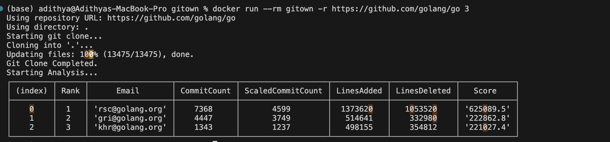
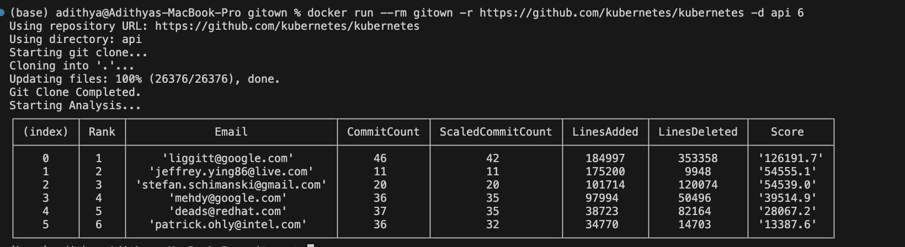

# gitown

## A Command Line Tool for Analyzing Git Repository Contributions

**gitown** is a command line tool designed to fetch the top contributors from a given Git repository based on their commit activity and code changes. It calculates a score for each author by aggregating the number of commits, lines added, and lines deleted. The tool then ranks the contributors and displays them in a table format.

## Features

- **Git Log Analysis**: Analyze the git log to extract commit data for each author, including commit count, lines added, and lines deleted.
- **Scaled Commit Count**: A novel metric that counts "separate" commits made by an author, where multiple commits within 30 minutes are considered as one.
- **Weighted Scoring System**: Author scores are calculated as a weighted sum of their commit count (50%), lines added (30%), and lines deleted (20%).
- **Custom Repository & Directory Support**: Clone any GitHub repository and analyze a specific directory within it.
- **Top N Contributors**: Display the top N contributors based on their calculated scores.

## Screenshot of Exection





## Installation

To install **gitown**, you will need to have Docker installed on your system.

### Build the Docker Image:

Run the following command in your terminal:

```bash
docker build -t gitown .
```

### Run the Docker Container:
To run the utility in a Docker container, use the following command:
```bash
docker run --rm gitown --help
```

### Available Options

- `-r`, `--repo <url>`: Repository HTTPS link (default: `https://github.com/golang/go`)
- `-d`, `--directory <path>`: Directory path to analyze (default: Root directory)
- `<number>`: Number of top authors to return (default: 3)


### Sample commands
```bash
docker run --rm gitown -r https://github.com/golang/go -d api 10
docker run --rm gitown -r https://github.com/golang/go -d api 5
docker run --rm gitown -r https://github.com/kubernetes/kubernetes -d cluster 10
docker run --rm gitown -r https://github.com/kubernetes/kubernetes
```

## How it Works

1. **Repository Cloning**: The tool first clones the repository specified via the `--repo` option.

2. **Git Log Fetching**: It fetches the git log using `git log --numstat`, collecting the author’s email, commit timestamp, and the number of lines added/deleted.

3. **Data Aggregation**: It aggregates data for each author, including their total number of commits, lines added, and lines deleted.

4. **Score Calculation**: Each author’s score is calculated based on a weighted sum of their commit count, lines added, and lines deleted. 
 The formula is:
```latex
score = (0.5 * scaledCommitCount) + (0.3 * linesAdded) + (0.2 * linesDeleted)
```


   If two commits are within 30 minutes of each other, they are counted as one commit. Otherwise, they are counted as two separate commits. This is the value of the scaled commit count, which is done to remove duplicate/unnecessary commits.

## Challenges and Solutions for Measuring Contributions

The current method of measuring contributions in software development primarily relies on commits, lines added, and lines deleted. While these metrics provide some insight, they have significant limitations:

### Overemphasis on Commit Frequency:

- **Challenge**: The number of commits can misrepresent an author’s impact, rewarding frequent but trivial commits over fewer, more meaningful contributions.
- **Solution**: Incorporate additional metrics that assess the significance of each commit, such as the complexity of changes and the number of files modified.

### Incomplete Metrics of Lines Added and Deleted:

- **Challenge**: Relying solely on lines added and deleted fails to capture the true essence of contributions, such as building complex features.
- **Solution**: Implement a nuanced scoring system that evaluates the nature of changes, possibly using commit messages or machine learning models.

### Neglecting Contextual Factors:

- **Challenge**: The current approach overlooks collaboration on complex tasks or mentoring newer contributors.
- **Solution**: Introduce a weighting system that factors in contextual contributions, recognizing their importance in team dynamics.
- 
### While most of the challenges can be solved by using static code analysis discussed in moving forward section.
## Moving Forward

To develop a more holistic contribution measurement system, we can:

1. **Make use of Static Code Analysis Tool**: Make use of SonarQube or any other toolset to calculate the impact and complexity of the commit. This helps in undermining refractor commints and give more weightage to commits that ship big features of fix commits.

2. **Create a Multi-Faceted Scoring System**: Develop a scoring methodology that encompasses a variety of metrics for a comprehensive view of contributions.
  
3. **Solicit User Feedback**: Engage with users to gather insights on which metrics best represent contributions.

4. **Implement Iterative Improvements**: Regularly assess and refine the contribution scoring methodology based on feedback and evolving best practices.

5. **Update Documentation and Encourage Community Input**: Revise the documentation to reflect the new scoring approach and encourage community input on the tool’s functionality.
